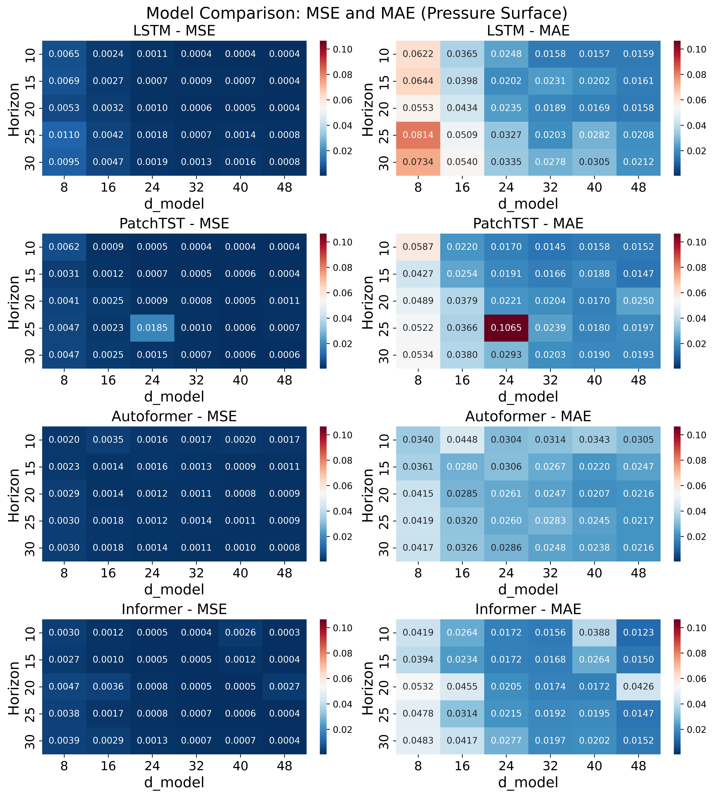
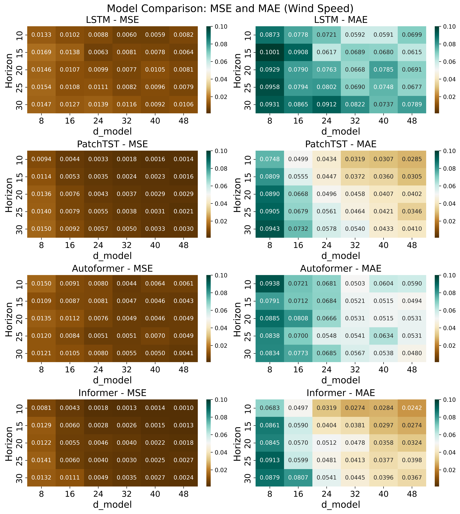

````markdown
# DeepKoopFormer

**A Koopman-Enhanced Transformer Framework for Robust Multivariate Time Series Forecasting**

---

## Overview

**DeepKoopFormer** is a modular and research-oriented library that unifies Transformer-based deep learning with Koopman operator theory for time series forecasting. The library is built for researchers and practitioners needing robust, interpretable, and scalable forecasting in complex settings, including climate, energy, and nonlinear dynamical systems.

DeepKoopFormer delivers Koopman-augmented versions of leading transformer models (PatchTST, Autoformer, Informer), plus conventional LSTM baselines, with fully reproducible benchmarking, training scripts, and ablation tools.

---

## Features

- **Koopman-Enhanced Transformer Architecture:**  
  Encoder–propagator–decoder pipeline, with the Koopman operator enforcing stable, linear latent dynamics between encoding and decoding stages.

- **Spectral and Lyapunov Stability Guarantees:**  
  - ODO (Orthogonal–Diagonal–Orthogonal) Koopman parametrization, with eigenvalues constrained to the unit circle.
  - Lyapunov-based loss penalizes transient latent growth, yielding exponential decay guarantees.

- **Comprehensive Benchmarking Suite:**  
  CLI-ready experiment scripts for LSTM, Koopman-PatchTST, Koopman-Autoformer, and Koopman-Informer, on both synthetic and real datasets.

- **Research-Grade Reproducibility:**  
  - Consistent data splits and random seeds.
  - Automatic metrics logging, result plotting, and model checkpointing.

- **HPC-Ready:**  
  Designed for large-scale grid search and high-performance environments.

---

## Installation

1. **Clone the repository:**
    ```bash
    git clone https://github.com/yourusername/deepkoopformer.git
    cd deepkoopformer
    ```
2. **Install the package and dependencies:**
    ```bash
    pip install -e .
    ```
    All dependencies (numpy, torch, pandas, scikit-learn, matplotlib, seaborn, scipy) are listed in `pyproject.toml`.

---

## Getting Started

### **Benchmarking Koopman-Enhanced Transformers**

The recommended way to run benchmarks is via the CLI-ready script in `examples/`:

```bash
python examples/run_benchmark.py --file ./data/wind_speeds_2020.npy --epochs 200 --seq_len 120 --save_dir results/
````

**Arguments:**

* `--file`: Path to `.npy` time series data (e.g. wind speeds, shape `[time, locations]`).
* `--epochs`: Number of training epochs (default: 200).
* `--seq_len`: Length of the context window (default: 120).
* `--save_dir`: Directory to save results, metrics, and checkpoints (default: `results/`).

You can customize other parameters, such as patch lengths and forecast horizons, by editing the script or extending the CLI.

---

### **Example Python Usage**

```python
from deepkoopformer.deepkoopformer.train import set_seed, train
from deepkoopformer.deepkoopformer.backbone import SimpleLSTMForecaster, Koopformer_PatchTST
from deepkoopformer.deepkoopformer.dataset import build_dataset

import numpy as np

# Load data
raw = np.load("data/wind_speeds_2020.npy")
x_in, x_out, _ = build_dataset(raw[:400, :], indices=[0, 5000, 10000], patch_len=120, horizon=20)

# LSTM Baseline
lstm = SimpleLSTMForecaster(num_features=3, hidden_size=64, num_layers=2, horizon=20)
pred, loss, eig = train(lstm, x_in, x_out, epochs=200, koop_attr=None, lyap_weight=0)

# Koopman-PatchTST Model
model = Koopformer_PatchTST(num_features=3, seq_len=120, horizon=20, patch_len=120, d_model=48)
pred, loss, eig = train(model, x_in, x_out, epochs=200, koop_attr="koop")
```

## Example Figures

### DeepKoopFormer Pressure Surface (Fixed Patch, 5 Channels)


### DeepKoopFormer Pressure Surface (Patch 120, H=15, d=8)


### DeepKoopFormer Wind Prediction (Patch 120, H=15, d=32)


### DeepKoopFormer Wind Speed (Fixed Patch, 5 Channels)



---

## Workflow

1. **Prepare your dataset** (e.g. wind speed time series as `.npy`).
2. **Configure and run experiments** using the provided CLI script.
3. **Analyze results** in the `results/` directory:

   * `metrics.csv` — All run metrics (MSE, MAE, settings).
   * `.pt` files — Model checkpoints.
   * `.png` — Training and forecast plots.

---

## Directory Structure

```
ddeepkoopformer/
│
├── deepkoopformer/
│   ├── __init__.py
│   ├── backbone.py       # Model architectures: PatchTST, Informer, Autoformer, LSTM, Koopman integration
│   ├── train.py          # Unified training/validation logic
│   ├── dataset.py        # Dataset preprocessing, splitting
│   ├── plot.py           # Plotting and saving figures/metrics
│   ├── koopman.py
│   ├── layers.py
│
├── examples/
│   ├── __init__.py
│   ├── run_benchmark.py      # Main CLI/benchmark script (see usage above)
│   ├── cli.py                # CLI interface (if separate from run_benchmark)
│   ├── results/
│   │   └── ...               # Results, figures, metrics, etc.
│   ├── cli_pressure_surface_deepkoopformer_forecasting_fixed_d_model.py
│   ├── cli_pressure_surface_deepkoopformer_forecasting_fixed_patch_length.py
│   ├── cli_windspeed_deepkoopformer_forecasting_fixed_d_model.py
│   ├── cli_windspeed_deepkoopformer_forecasting_fixed_patch_length.py
│   ├── Lorenz_strickt_koop_patchtst_auto_inf_former_svd_lypanov.py
│   ├── Lorenz_strickt_koop_patchtst_former_svd_lypanov.py
│   ├── Rossler_strickt_koop_patchtst_auto_in_former_svd_lypanov.py
│   ├── Rossler_strickt_koop_patchtst_former_svd_lypanov.py
│   ├── VanderPol_strickt_koop_patch_auto_in_former_svd_lyapanov.py
│   ├── deep_koop_patchtst_auto_info_former_lstm_grid_crypto_currency.py
│   ├── deep_koop_patchtst_auto_info_former_lstm_grid_energy_system.py
│   ├── deep_koop_patchtst_auto_info_former_lstm_wind_speed_era5.py
│   ├── pressure_surface_2020.npy
│   └── wind_speeds_2020.npy
│
├── data/
│   ├── wind_speeds_2020.npy  # Example data (not packaged, see repo/download)
│   ├── pressure_surface_2020.npy
│
├── project.toml
├── README.md
└── setup.py

```

---

## Theory

**DeepKoopFormer** combines:

* Patch-based, attention-driven encoding (PatchTST, Informer, Autoformer)
* A strictly Schur-stable Koopman operator (enforced by ODO factorization and spectral constraints)
* Lyapunov-inspired loss for energy dissipation and robust, stable prediction
* Channel-independent embedding for multivariate signals (reduces overfitting in high dimensions)

**Provable guarantees** include closed-form error decay under perturbations, bounded gradients, and robustness on long-range predictions.

---

## Results

* **Synthetic Dynamical Systems:**
  Koopman-augmented models accurately forecast nonlinear and chaotic signals (e.g., Van der Pol, Lorenz systems), with strong robustness to noise.

* **Climate Datasets:**
  Outperform LSTM and standard transformers on CMIP6/ERA5 wind speed and surface pressure, especially for longer horizons and higher dimensions.
  
* **Electricity Generation Datasets:**
  See [Link](https://github.com/afshinfaramarzi/Energy-Demand-electricity-price-Forecasting/tree/main)

* **Crypto Currency Datasets:**

  See [Link](https://github.com/Chisomnwa/Cryptocurrency-Data-Analysis)

* **Results:**

For the results of the experiments see the [Zenodo](https://zenodo.org/records/15826887)

* **Benchmarks:**

  * Extensive grid searches over patch size, context length, forecast horizon, and model width.
  * Automatic heatmaps and error tables (MSE, MAE) generated for every experiment.

---

## Reference

For theoretical background, methodology, and empirical benchmarks, please see the [PDF](https://arxiv.org/abs/2505.20048).

If you use DeepKoopFormer in your work, please cite:

```bibtex
@article{Forootani2024deepkoopformer,
  title={DeepKoopFormer: A Koopman Enhanced Transformer Based Architecture for Time Series Forecasting},
  author={Ali Forootani, Mohammad Khosravi, Masoud Barati},
  year={2025},
  note={arXiv preprint arXiv:XXXX.XXXXX}
}
```

---

## License

MIT License

---

## Contact

**Ali Forootani**
Helmholtz Center for Environmental Research-UFZ, Leipzig, Germany
[aliforootani@ieee.org](mailto:aliforootani@ieee.org) / [ali.forootani@ufz.de](mailto:ali.forootani@ufz.de)

---
